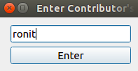
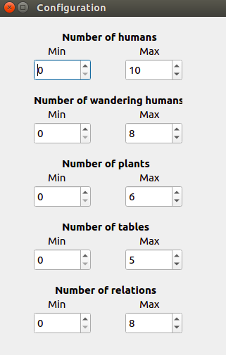
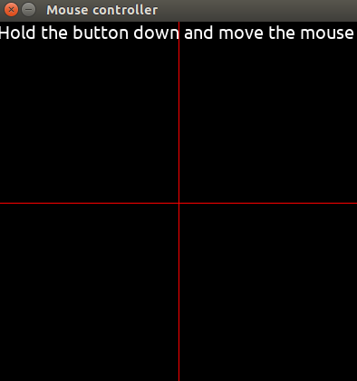
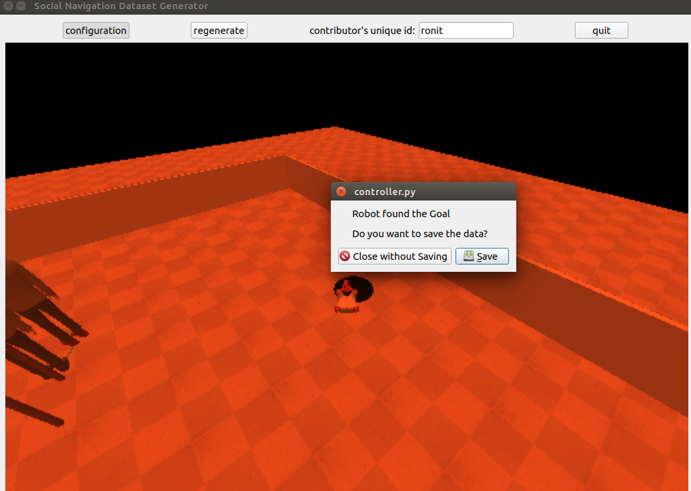

1. PyTorch [https://pytorch.org/get-started/locally/](https://pytorch.org/get-started/locally/)
2. DGL [https://www.dgl.ai/pages/start.html](https://www.dgl.ai/pages/start.html)
3. PyTorch Geometric [https://pytorch-geometric.readthedocs.io/en/latest/notes/installation.html](https://pytorch-geometric.readthedocs.io/en/latest/notes/installation.html)
4. PyRep [https://github.com/stepjam/PyRep](https://github.com/stepjam/PyRep) (This link would also help in the installation of CoppeliaSim)

# Running the repo

After cloning the directory, execute the following commands:
1. Shift the interfaces to proper location.
    ```
    cp interfaces/* /opt/robocomp/interfaces
    cp interfaces/* /opt/robocomp/interfaces/IDSLs
    ```
2. Run the tool.
    ```
    bash run.sh
    ```

# Usage

After you run the above commands the SONATA GUI opens up.

1. Write the contributor's(user's) name so that the data saved can be marked by the users name.



2. After this the simulation will start with a green tint, and until the mouse controller is clicked robot will not move. 


3. Select the configuration from the top bar of the SONATA GUI to select the range of different entities you want to add in the scene. You can also regenerate a scene if you don't like the settings of entities by using the regenerate button from the top bar. We also provided blue lines between two entities to show that they are interacting with each other.



4. click on the mouse controller and hold the left key and drag the mouse to move the robot in that direction.



5. Move the robot to the goal marked by the cone.


6. Save your data.




After you click and save the data, a JSON file is generated and the full episode gets saved with timestamps. For the usecase we take these JSONs and convert them into graphs using socnavData data loader, which is then fed into the GNNs. Once the model is trained you can run the toolkit in test mode by setting TEST_MODE boolean to true in the controller's specificworker.py file.

